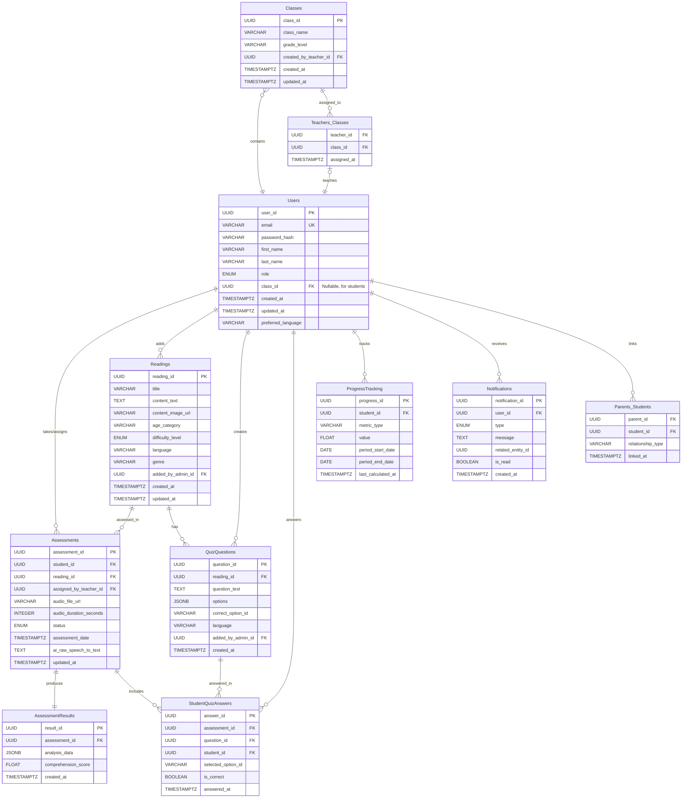

# Readmaster.ai - Definitive Technical Documentation

This document provides a comprehensive technical overview of the Readmaster.ai platform, including its architecture, database design, core components, and operational strategies. It is intended for software engineers, architects, and technical stakeholders.

## Table of Contents

* **System Overview**

* **UML Diagrams**

    * Database Entity Relationship Diagram (ERD)

    * System Architecture Diagram

    * User Role Activity Diagram

    * Assessment Process Sequence Diagram

    * Class Diagram - Core Domain Models

* **System Capabilities**

    * Frontend Application

    * Backend Service (RESTful API)

* **Core Components & Design**

    * Clean Architecture Structure

    * Design Patterns Implementation

    * Database Layer (SQLAlchemy)

    * Authentication & Authorization

    * API Endpoints with Request/Response Schemas

    * File Handling Strategy

* **Technical Requirements**

    * Database Schema (PostgreSQL)

* **Performance Considerations**

    * Integration Points

    * Error Handling and Logging Strategy

    * Deployment Architecture

## 1. System Overview

Readmaster.ai is a web-based reading assessment and development platform that uses artificial intelligence to analyze and help improve students' reading performance. The system is designed to serve a diverse user base—including students, parents, teachers, and administrators—by providing tailored tools for each role. At its core, the platform aims to transform the traditionally subjective process of reading assessment into an objective, data-driven, and scalable practice.

The system consists of a modern frontend web application and a robust backend service that handles business logic, AI processing, and database operations.

### Key Features

* **AI-Powered Reading Fluency Analysis**: Measures words per minute, accuracy, and prosody.

* **Pronunciation Assessment**: Pinpoints mispronounced words and provides phonetic feedback.

* **Reading Comprehension Evaluation**: Uses AI-assisted quizzes to test understanding.

* **Multi-language Support**: The platform is designed to accommodate various languages for both content and user interface.

* **Real-time Progress Tracking**: Offers dashboards with detailed analytics on student performance over time.

* **Role-Based Access Control (RBAC)**: A granular permission system ensures that users can only access features and data relevant to their specific roles (Student, Parent, Teacher, Admin).

## 2. UML Diagrams

The following UML diagrams visualize the system's structure, behavior, and data relationships from different perspectives.

### 2.1. Database Entity Relationship Diagram (ERD)

This diagram illustrates the database schema, showing the different tables (entities), their attributes (columns), and the relationships between them.



**Intention and Explanation**
The **ERD** is a normalized relational model serving as the application's single source of truth.

* **Core Entities**: `Users`, `Readings`, `Assessments`, and `AssessmentResults` form the core of the system.

* **Relational Structure**: A one-to-many relationship exists between `Classes` and `Users` (for students), enforced by a nullable `class_id` foreign key on the `Users` table. Many-to-many relationships, such as between parents and students or teachers and classes, are managed via junction tables (`Parents_Students`, `Teachers_Classes`).

* **Data Types**: `UUID` is used for primary keys for global uniqueness. `TIMESTAMPTZ` is used for all temporal data to ensure timezone consistency. `JSONB` stores complex, queryable AI analysis data efficiently.

### 2.2. System Architecture Diagram

This diagram provides a high-level overview of the system's architecture.


**Intention and Explanation**
The architecture uses a decoupled, microservices-oriented approach for scalability and maintainability.

* **Client & Delivery**: A **React frontend** is accessed via browsers, with static assets served from a **CDN** for low latency. A **Load Balancer** handles traffic and TLS termination.

* **Application Layer**: The backend consists of a main **RESTful API**, a dedicated **Authentication Service (JWT)**, and a **WebSocket Server** for real-time notifications.

* **Processing Layer (Asynchronous)**: Long-running tasks like **AI analysis** are offloaded to a **queue system** and handled by independent **async workers** to keep the API responsive.

* **Data Layer**: **PostgreSQL** is the primary database, **Redis** is used for caching, and a **Cloud Storage service** (like GCS/S3) stores large binary files.

* **Observability**: Centralized logging and monitoring services provide insights into system health and performance.

### 2.3. User Role Activity Diagram

This diagram shows the workflows available to each user role.


**Intention and Explanation**
The diagram clarifies the functionality scope for each role.

* **Student**: Flow is centered on taking assessments and viewing personal progress.

* **Parent**: A supervisory role with read-only access to their children's progress.

* **Teacher**: Manages classes, assigns readings, and has full CRUD (Create, Read, Update, Delete) capabilities over students within their classes.

* **Admin**: Manages platform-wide data (users, content) and system settings.

### 2.4. Assessment Process Sequence Diagram

This diagram details the interactions for a reading assessment.


**Intention and Explanation**
This sequence illustrates the asynchronous assessment flow designed for a responsive user experience.

* **Initiation**: The student starts an assessment for a specific reading.

* **File Upload**: The frontend requests a pre-signed URL from the API, uploads the audio file directly to a cloud storage bucket. This avoids proxying large files through the backend server.

* **Background Processing**: Upon confirmation, the API queues a job for the AI Service, which processes the audio asynchronously.

* **Notification & Retrieval**: Once processing is complete, a WebSocket notification alerts the user, who can then fetch the detailed results.

### 2.5. Class Diagram - Core Domain Models

This diagram shows the object-oriented representation of core business entities.


**Intention and Explanation**
This class diagram maps domain concepts to software objects.

* **Inheritance**: `Student`, `Teacher`, `Parent`, and `Admin` inherit from a base `User` class.

* **Relationships & Methods**: The `Student` class has a single `Class` attribute, reflecting the one-to-many relationship. The `Teacher` class includes methods for student CRUD operations within a class.

* **Encapsulation**: Each class bundles its data and the logic that operates on it.

## 3. System Capabilities

### 3.1. Frontend Application

* **Technology Stack**: **React**, **TypeScript**

* **Internationalization**: **i18n** library implementation

* **Key Features**: Role-based panels for Students, Parents, and Teachers, providing access to assignments, progress tracking, class management, and detailed performance analytics. A settings panel allows for profile and preference management.

### 3.2. Backend Service (RESTful API)

* **Technology Stack**: **FastAPI** (Python), **SQLAlchemy**, **Pydantic**, **JWT**, **pytest**, **Redis**, **Celery**.

* **Architecture Pattern**: **Clean Architecture**.

* **Core Responsibilities**: Database operations, business logic, asynchronous AI processing via job queues, and progress tracking.

## 4. Core Components & Design

### 4.1. Clean Architecture Structure

The backend isolates business rules from frameworks and external dependencies for maintainability and testability.

```
src/
├── domain/              # Enterprise Business Rules (Entities, Value Objects)
├── application/         # Application Business Rules (Use Cases, DTOs)
├── infrastructure/      # Frameworks & Drivers (DB, external APIs, file storage)
├── presentation/        # Interface Adapters (API endpoints, schemas)
└── shared/              # Shared utilities (exceptions, constants)
```

### 4.2. Design Patterns Implementation

* **Repository Pattern**: Abstracts the data layer.

* **Service Layer Pattern (Use Cases)**: Encapsulates business logic.

* **Factory Pattern**: Decouples creation of complex objects like AI service clients.

* **Observer Pattern**: Used for handling notifications.

* **Dependency Injection**: Managed via FastAPI's built-in system.

### 4.3. Database Layer (SQLAlchemy)

**SQLAlchemy** is used as the ORM for database interaction, with **Alembic** managing schema migrations. An asynchronous engine and session maker are configured for non-blocking database operations. Repositories implement the data access logic using the async session.

### 4.4. Authentication & Authorization

* **Authentication**: Implemented using **JSON Web Tokens (JWT)**. Short-lived access tokens authenticate API requests, while long-lived, securely stored refresh tokens are used to obtain new access tokens without re-authentication.

* **Authorization**: The system employs a robust **Role-Based Access Control (RBAC)** model. Each API endpoint is protected, and the business logic verifies that the authenticated user's role grants them the necessary permissions to perform the requested action. This ensures a strict separation of duties and data access privileges.

#### Detailed Role Capabilities

Below is a detailed breakdown of the capabilities and data access restrictions for each user role.

**Student**
The **Student** role is focused on the core learning experience. All actions are scoped to the student's own data.

* **Profile Management**: Read and update their own user profile (`/api/v1/users/me`).

* **Reading Materials**: List and browse all available reading materials (`/api/v1/readings`). View details of a specific reading, including quiz questions (without correct answers).

* **Assessments**: Create new assessments for themself (`/api/v1/assessments`). Perform all steps of an assessment: request upload URLs, confirm uploads, and submit quiz answers. Read detailed results and analysis for their own completed assessments (`/api/v1/assessments/{assessment_id}/results`).

* **Notifications**: Receive and manage their own notifications (e.g., new assignment, results ready).

**Parent**
The **Parent** role is supervisory, providing read-only access to their linked children's activities.

* **Profile Management**: Read and update their own user profile.

* **Child Management (MVP)**: For the Minimum Viable Product (MVP), parents will directly **create and manage** child accounts that they own. This includes creating new child accounts via the new API endpoint:

    * **POST /api/v1/parent/children**: Create a new student account linked to the parent.
        They can also list all linked children (`/api/v1/parent/my-children`) and unlink a child from their account. The ability for students to initiate linking via an invitation process is planned for future iterations.

* **Progress Monitoring**: Read the progress summary for each linked child (`/api/v1/parent/children/{child_id}/progress`). Read detailed results of any specific assessment taken by a linked child (`/api/v1/parent/children/{child_id}/assessments/{assessment_id}/results`).

* **Notifications**: Receive and manage their own notifications, which may pertain to their children's activities.

**Teacher**
The **Teacher** role is focused on class and student management within their assigned scope.

* **Profile Management**: Read and update their own user profile.

* **Class Management**: Perform full CRUD operations (Create, Read, Update, Delete) on classes they own (`/api/v1/teacher/classes`).

* **Student Management (within their classes - MVP)**: For the Minimum Viable Product (MVP), teachers will directly **create and manage** student accounts. This includes adding new students to a class they own, removing students from a class they own, and listing all students enrolled in their classes. They can create new student accounts via the new API endpoint:

    * **POST /api/v1/teacher/students**: Create a new student account. This student can then be added to a class using `POST /api/v1/teacher/classes/{class_id}/students`.
        The ability for students to initiate linking via an invitation process is planned for future iterations.

* **Assignments & Monitoring**: Assign readings to individual students or entire classes they own (`/api/v1/teacher/assignments/readings`). Read class-level progress reports for their classes (`/api/v1/teacher/classes/{class_id}/progress-report`). Read progress summaries for any student within their classes (`/api/v1/teacher/students/{student_id}/progress-summary`).

**Admin**
The **Admin** role has the highest level of privilege, with system-wide management capabilities.

* **User Management**: Perform full CRUD operations on any user account (Student, Parent, Teacher), except for other Admins. Can reassign roles and manage user details.

* **Content Management**: Perform full CRUD operations on all reading materials (`/api/v1/admin/readings`). Perform full CRUD operations on all quiz questions for any reading (`/api/v1/admin/questions`).

* **System Configuration**: Read and update system-wide configuration settings (`/api/v1/admin/system-configurations`).

* **Analytics & Reporting**: Access system-wide analytics and reports (endpoints to be defined).

### 4.5. API Endpoints with Request/Response Schemas

API endpoints are versioned (`/api/v1/...`) and logically grouped by resource and user role. All request and response bodies are strictly validated using **Pydantic** schemas. Standardized pagination is used for all list endpoints.

**New API Endpoints for Account Creation:**

* **POST /api/v1/parent/children**

    * **Summary**: Parent Create Child Account

    * **Description**: Allows an authenticated parent to create a new student account that is automatically linked as their child. The created user's role will be 'student'.

    * **Request Body**:

        ```python
        class ParentChildCreateRequest(UserCreateRequest):
            # Inherits email, password, first_name, last_name, preferred_language from UserCreateRequest
            role: Literal["student"] = "student" # Role is fixed to 'student'
        ```

    * **Responses**:

        * `201 Created`: `UserResponseDTO` (details of the newly created student account)

        * `401 Unauthorized`: Invalid or missing authentication token.

        * `403 Forbidden`: Authenticated user is not a parent.

        * `422 Validation Error`: Invalid request body.

* **POST /api/v1/teacher/students**

    * **Summary**: Teacher Create Student Account

    * **Description**: Allows an authenticated teacher to create a new student account. The created user's role will be 'student'. This student can then be added to a class using `POST /api/v1/teacher/classes/{class_id}/students`.

    * **Request Body**:

        ```python
        class TeacherStudentCreateRequest(UserCreateRequest):
            # Inherits email, password, first_name, last_name, preferred_language from UserCreateRequest
            role: Literal["student"] = "student" # Role is fixed to 'student'
        ```

    * **Responses**:

        * `201 Created`: `UserResponseDTO` (details of the newly created student account)

        * `401 Unauthorized`: Invalid or missing authentication token.

        * `403 Forbidden`: Authenticated user is not a teacher.

        * `422 Validation Error`: Invalid request body.

**Example Schema: User Creation (Existing)**

```python
# presentation/schemas/user_schemas.py
from pydantic import BaseModel, EmailStr
from uuid import UUID

class UserCreateRequest(BaseModel):
    email: EmailStr
    password: str
    first_name: str | None = None
    last_name: str | None = None
    role: str | None = None

class UserResponse(BaseModel):
    user_id: UUID
    email: EmailStr
    role: str
    first_name: str | None
    last_name: str | None

    class Config:
        from_attributes = True # Formerly orm_mode
```

### 4.6. File Handling Strategy

* **Upload Strategy**: The frontend requests a pre-signed URL from the backend to upload audio files directly to a cloud storage bucket. This avoids proxying large files through the backend service.

* **File Processing**: Audio files are validated for format, duration, and size. They are then standardized to a consistent format (e.g., FLAC) for reliable AI processing. Files are organized logically within the cloud storage bucket.

## 5. Technical Requirements

### 5.1. Database Schema (PostgreSQL)

The schema uses specific enum types for controlled vocabularies and is indexed for performance.

```sql
-- Enum types for controlled vocabularies
CREATE TYPE user_role_enum AS ENUM ('student', 'parent', 'teacher', 'admin');
CREATE TYPE assessment_status_enum AS ENUM ('pending_audio', 'processing', 'completed', 'error');

-- Table creation with indexes
CREATE TABLE Users (
    user_id UUID PRIMARY KEY,
    email VARCHAR(255) UNIQUE NOT NULL,
    class_id UUID REFERENCES Classes(class_id), -- Nullable FK for students
    -- ... other columns
);

CREATE TABLE Assessments (
    assessment_id UUID PRIMARY KEY,
    student_id UUID REFERENCES Users(user_id),
    status assessment_status_enum,
    assessment_date TIMESTAMPTZ,
    -- ... other columns
);

-- Indexes are crucial for query performance
CREATE INDEX idx_assessment_student_date ON Assessments (student_id, assessment_date);
CREATE INDEX idx_assessment_status ON Assessments (status);
CREATE INDEX idx_users_class_id ON Users (class_id);
```

## 6. Performance Considerations

* **Asynchronous Operations**: The entire backend leverages **async/await** for non-blocking I/O.

* **Background Jobs**: Time-consuming AI analysis is offloaded to background workers using **Celery**.

* **Caching Strategy**: **Redis** caches user sessions, permissions, and frequently accessed static data like reading materials to reduce database load.

* **Database Optimization**: All foreign keys and frequently filtered columns are indexed. **SQLAlchemy's** connection pool is used to manage database connections efficiently.

